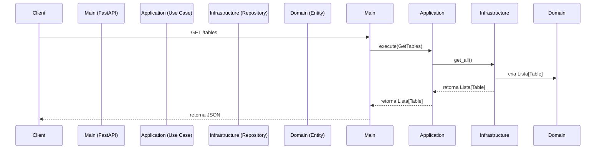

# Backend

Este diretório contém o código do backend da aplicação Snowflake Table Catalog.

## Arquitetura

O backend é construído utilizando os princípios da Clean Architecture para garantir que o código seja organizado, testável e fácil de manter. A arquitetura é dividida em quatro camadas principais:

- `domain`: Contém a lógica de negócio principal e as entidades da aplicação. Não depende de nenhuma outra camada.
- `application`: Orquestra o fluxo de dados e contém os casos de uso da aplicação. Depende apenas da camada de `domain`.
- `infrastructure`: Contém os detalhes de implementação, como acesso a banco de dados, comunicação com serviços externos e frameworks. Depende das camadas de `domain` e `application`.
- `main`: É o ponto de entrada da aplicação, onde o servidor web é configurado e as dependências são injetadas.

### Fluxo de uma Requisição

O fluxo de uma requisição para o endpoint `/tables` é o seguinte:

1. O cliente (frontend) envia uma requisição para o endpoint `/tables` no servidor FastAPI.
2. O `server.py` na camada `main` recebe a requisição.
3. O servidor instancia um `TableRepository` (atualmente `SnowflakeTableRepository` para produção) e o injeta no caso de uso `GetTables`. Para desenvolvimento ou uso offline, o `CsvTableRepository` pode ser utilizado.
4. O caso de uso `GetTables` na camada de `application` é executado.
5. O caso de uso chama o método `get_all()` do `TableRepository`.
6. O `TableRepository` na camada de `infrastructure` busca os dados (do Snowflake ou de um arquivo CSV), os transforma em uma lista de entidades `Table` do `domain` e os retorna para o caso de uso.
7. O caso de uso retorna a lista de tabelas para o servidor na camada `main`.
8. O servidor FastAPI serializa os dados para JSON e os retorna ao cliente.



## Como Executar

1. **Instale as dependências:**

A partir do diretório raiz do projeto, execute:
    ```bash
    pip install -r backend/requirements.txt
    ```

2. **Configure as variáveis de ambiente:**

A aplicação utiliza um arquivo `.env` para carregar as variáveis de ambiente. A biblioteca `python-dotenv` é usada para isso.

Crie um arquivo `.env` na raiz do projeto e adicione as seguintes variáveis:

- **Para desenvolvimento (usando CSV):**

    ```bash
     APP_ENV=development
    ```

3. **Para produção (usando Snowflake):**

    ```bash
     APP_ENV=production
     SNOWFLAKE_USER=seu_usuario
     SNOWFLAKE_PASSWORD=sua_senha
     SNOWFLAKE_ACCOUNT=sua_conta
     ```

1. **Inicie o servidor:**

A partir do diretório raiz do projeto, execute:
    ```bash
    uvicorn backend.main.server:app --reload
    ```

O servidor estará disponível em `http://127.0.0.1:8000`.

## Docker

Para facilitar o desenvolvimento e o deploy, a aplicação pode ser executada em um contêiner Docker.

1.  **Construa a imagem Docker:**

    A partir do diretório `backend`, execute:
    ```bash
    docker build -t snowflake-table-catalog-backend .
    ```

2.  **Execute o contêiner:**
    ```bash
    docker run -p 8000:8000 snowflake-table-catalog-backend
    ```

A aplicação estará disponível em [http://localhost:8000](http://localhost:8000).
